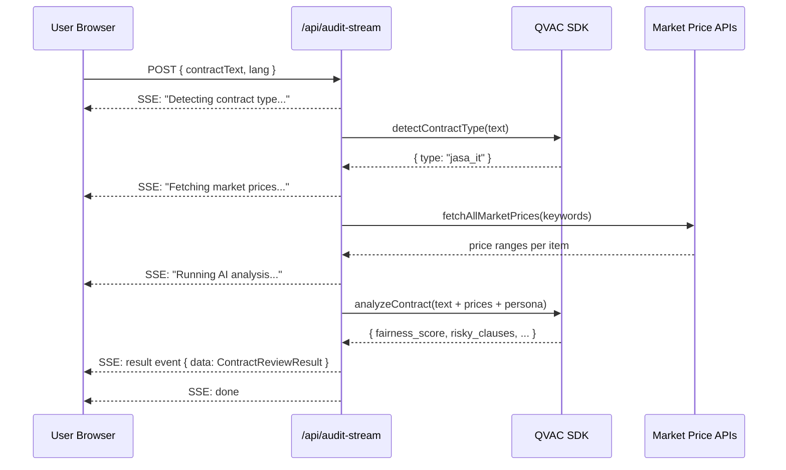
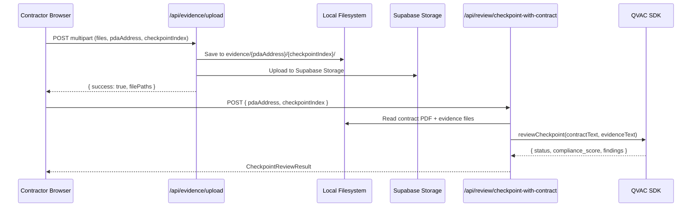

# System Architecture Overview

## High-Level Architecture

```mermaid
graph TB
    subgraph Browser["User Browser"]
        UI["Next.js Frontend\nApp Router\n/audit · /create · /dashboard"]
        Wallet["Phantom Wallet\nExtension"]
    end

    subgraph NextAPI["Next.js API Routes"]
        upload["/api/upload\npdf-parse"]
        audit["/api/audit\n/api/audit-stream"]
        checkpoint["/api/review/checkpoint-with-contract"]
        chat["/api/chat-contract"]
        evidence["/api/evidence/upload"]
    end

    subgraph AI["AI Layer"]
        qvac["QVAC SDK\n@qvac/sdk\nQwen3 local inference"]
        prices["Market Price APIs\nBlibli · SerpAPI"]
    end

    subgraph Storage["Storage"]
        localfs["Local Filesystem\nD:\\frontier\\evidence\\"]
        supabase["Supabase\nPostgreSQL + Storage"]
        pinata["Pinata / IPFS\n(optional)"]
    end

    subgraph Solana["Solana Devnet"]
        program["ContractGuard Program\n2Htsz7Xf4YWZTc8t..."]
        config["Config PDA"]
        contract["Contract PDA\n+ USDC Escrow"]
        mint["USDC Mint PDA"]
        ata["User ATAs"]
    end

    subgraph Backend["FastAPI Backend"]
        fastapi["market price scraping\nBlibli · SerpAPI"]
    end

    UI --> NextAPI
    NextAPI --> qvac
    NextAPI --> prices
    NextAPI --> localfs
    NextAPI --> supabase
    NextAPI --> pinata
    NextAPI --> fastapi
    UI --> Wallet
    Wallet --> program
    program --> config
    program --> contract
    program --> mint
    program --> ata

    style Browser fill:#1a1a2e,stroke:#9945FF
    style NextAPI fill:#0d1f1a,stroke:#14F195
    style AI fill:#1a0d2e,stroke:#9945FF
    style Solana fill:#0d1a2d,stroke:#38BDF8
    style Storage fill:#1a1a0d,stroke:#14F195
    style Backend fill:#0d1a1a,stroke:#38BDF8
```



---

## Data Flow — Contract Audit (Streaming)



---

## Data Flow — Evidence Upload & Checkpoint Review



---

## Key Architectural Decisions

### 1. QVAC SDK for Local AI Inference

All AI analysis (contract review, checkpoint verification, Q&A) runs through the **QVAC SDK** (`@qvac/sdk`), which calls a locally-running Qwen3 model. This means:

- No external AI API key required
- No subprocess spawning or child processes
- Deterministic output (temperature = 0)
- Three model tiers: `fast` (Llama 3.2 1B), `smart` (Qwen3 4B), `best` (Qwen3 8B)

All AI calls go through the `runQVAC()` function in `app/lib/contractAgent.ts`.

### 2. Local Filesystem for Evidence Storage

Evidence files are stored on the local filesystem at `D:\frontier\evidence\{pdaAddress}\{checkpointIndex}\`. This allows the checkpoint review API to read actual file contents for AI analysis, rather than relying on text descriptions.

Contract PDFs (uploaded after on-chain deployment) are stored at `D:\frontier\evidence\{pdaAddress}\contract\`.

### 3. No External State Management

All UI state uses React's built-in hooks and Context API:
- `LanguageProvider` — EN/ID switching
- `ThemeProvider` — dark/light theme + CSS variables
- `WalletProvider` — Solana wallet connection

No Redux, Zustand, or similar libraries — keeps the bundle lean.

### 4. Anchor IDL for Type-Safe Blockchain Calls

The Solana program's IDL (`app/lib/idl.ts`) is imported to create an Anchor `Program` client. This provides type-safe method calls matching the on-chain program instructions exactly.

### 5. PDA-Based Contract Identity

Every on-chain contract is a Program Derived Address seeded with `[client_pubkey, contractor_pubkey, created_at_timestamp]`. Contracts are deterministically addressable with no central registry.

---

## Directory Map

```
frontend/
├── app/
│   ├── page.tsx              ← Landing page
│   ├── layout.tsx            ← Root layout + all providers
│   ├── globals.css           ← CSS variables + base styles
│   ├── audit/page.tsx        ← Audit feature
│   ├── create/page.tsx       ← Create & deploy contract
│   ├── dashboard/
│   │   ├── page.tsx          ← Contract list
│   │   └── [id]/page.tsx     ← Contract detail + milestones
│   ├── api/                  ← Next.js API routes (server-side)
│   │   ├── upload/           ← PDF text extraction
│   │   ├── audit/            ← Synchronous AI audit
│   │   ├── audit-stream/     ← Streaming AI audit (SSE)
│   │   ├── chat-contract/    ← AI Q&A
│   │   ├── review/           ← Checkpoint review (with files)
│   │   ├── review-checkpoint/← Checkpoint review (metadata only)
│   │   ├── evidence/         ← Evidence file upload
│   │   ├── contracts/        ← Contract PDF + metadata endpoints
│   │   ├── market/           ← Market price proxy
│   │   └── demo-pdf/         ← Serve demo PDF
│   ├── components/           ← Reusable React components
│   ├── lib/                  ← Utilities, hooks, AI agent
│   │   ├── contractAgent.ts  ← All AI logic via QVAC SDK
│   │   ├── useContractProgram.ts ← Solana/Anchor hooks
│   │   └── idl.ts            ← Anchor IDL
│   └── i18n/                 ← Translation dictionaries
├── agent/                    ← AI system prompt (CLAUDE.md — used as QVAC system prompt)
├── public/                   ← Static assets
├── docs/                     ← This documentation
└── .env.local                ← Environment config
```
