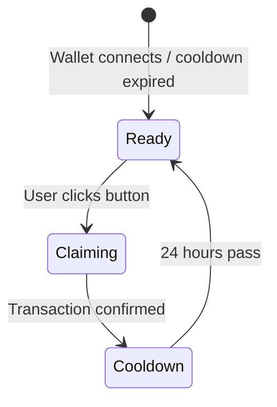

# Claim Mock USDC

ContractGuard runs on Solana Devnet with a custom **mock USDC token** for testing escrow contracts end-to-end. Real money is never involved.

---

## How to Claim

1. Connect your Phantom wallet (set to Devnet)
2. The **Claim 1,000** button appears to the right of your wallet address in the navbar
3. Click it
4. Approve the transaction in Phantom (~0.001 SOL fee)
5. 1,000 mock USDC is minted to your wallet

---

## Cooldown States

The claim button has three states:



| State | Button Shows | Description |
|-------|-------------|-------------|
| Ready | `Claim 1,000` | Available to claim |
| In-flight | `claiming...` + spinner | Transaction pending |
| Cooldown | `23h 42m` | Countdown to next claim |

---

## Wallet Popup

Click your wallet **address pill** (left of the claim button) to open a popup showing:
- **SOL balance** — your Devnet SOL for transaction fees
- **USDC balance** — your current mock USDC
- **Disconnect** button

---

## Token Details

| Property | Value |
|----------|-------|
| Token Name | Mock USDC |
| Decimals | 6 |
| Mint PDA seed | `"usdc_mint"` |
| Amount per claim | 1,000 USDC |
| Cooldown period | 24 hours |
| Network | Solana Devnet |

---

## Get Devnet SOL (for transaction fees)

You'll need a small amount of Devnet SOL to pay transaction fees. Get it free from a faucet:

```bash
# Using Solana CLI
solana airdrop 2 <YOUR_WALLET_ADDRESS> --url devnet

# Or use the web faucet:
# https://faucet.solana.com
```

---

## For Developers

The claim flow in `app/components/WalletButton.tsx` constructs two instructions manually:

**Instruction 1 — Create ATA (idempotent)**
Ensures the user's USDC Associated Token Account exists before minting.

**Instruction 2 — mint_usdc**
Calls the ContractGuard program's `mint_usdc` instruction via its 8-byte discriminator.

Both instructions are batched into a single transaction — one Phantom approval, one confirmation.

See [Instructions reference](../blockchain/instructions.md) for the full account layout.
