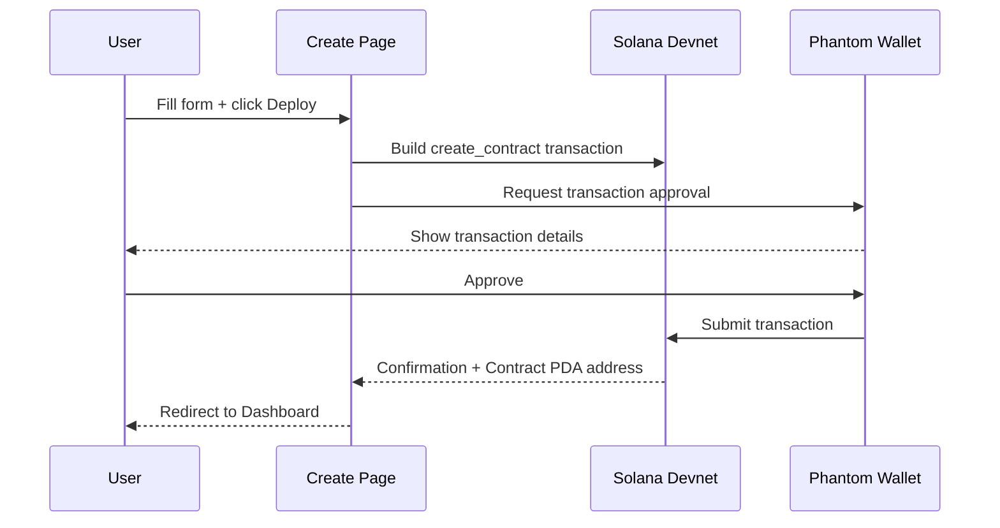
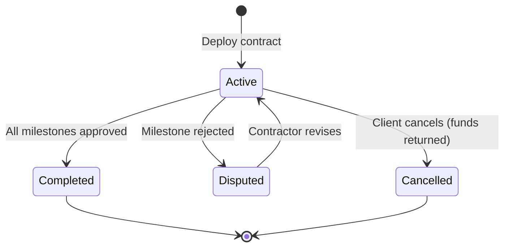

# Create & Deploy Contract

**Route:** `/create`
**File:** `app/create/page.tsx`

The Create page deploys a contract on-chain as a Solana escrow. Funds are locked in the smart contract and can only be released when milestones are approved.

---

## Prerequisites

Before creating a contract:
- Wallet connected (Phantom, set to Devnet)
- Sufficient USDC balance — [claim 1,000 mock USDC](claim-usdc.md) from the navbar
- Contract audited (recommended — paste the audit hash for on-chain proof)

---

## Form Fields

| Field | Required | Description |
|-------|----------|-------------|
| Contract Title | Yes | Human-readable name |
| Description | Yes | Scope of work |
| Client Wallet | Yes | Payer's Solana public key |
| Contractor Wallet | Yes | Service provider's public key |
| Total Amount (USDC) | Yes | Full contract value |
| Milestones | Yes | At least one with title + amount |
| Audit Hash | No | SHA-256 from the Audit page |
| Start Date / End Date | No | Contract period |

> **Tip:** If you just audited a contract on `/audit`, click **Create Contract** there — the form will be pre-filled from the audit results.

---

## Defining Milestones

A contract must have at least one milestone. Milestone amounts must add up to the total contract value.

**Example breakdown:**
```
Milestone 1: UI Design Mockups              500 USDC
Milestone 2: Backend API Development      1,500 USDC
Milestone 3: Testing & Deployment           500 USDC
──────────────────────────────────────────────────
Total                                     2,500 USDC
```

---

## Deployment Flow



---

## What Gets Created On-Chain

After deployment, two accounts are created on Solana:

| Account | Address | Content |
|---------|---------|---------|
| Contract PDA | Derived from `[client, contractor, created_at]` | Contract data, milestones, status |
| USDC Escrow ATA | ATA owned by Contract PDA | Locked USDC funds |

Additionally, the contract PDF (if uploaded) is stored locally at:
```
D:\frontier\evidence\{pdaAddress}\contract\
```

And contract metadata is saved to Supabase for fast querying.

---

## Contract Statuses



---

## Next Step

Manage milestones and release funds → [Dashboard & Milestones](dashboard.md)
