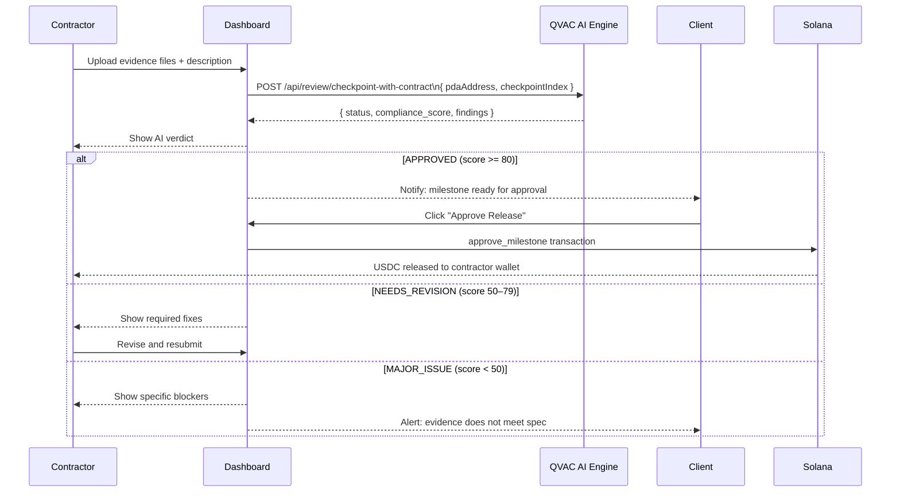
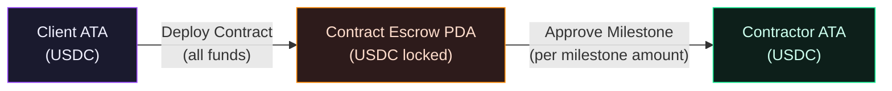

# Dashboard & Milestones

**Route:** `/dashboard` and `/dashboard/[id]`
**Files:** `app/dashboard/page.tsx`, `app/dashboard/[id]/page.tsx`

The Dashboard is your command center — showing all active and completed contracts, milestone statuses, and fund positions in real time.

---

## Dashboard List (`/dashboard`)

### What You'll See
- All contracts where your wallet is client or contractor
- Contract title, status badge, total value, creation date
- Progress indicator: milestones approved / total
- Quick link to each contract's detail page

### Empty State

If you have no contracts yet, two action buttons guide you through the right flow:
1. **Audit a Contract** → `/audit` *(start here — always audit before deploying)*
2. **Create Contract** → `/create`

---

## Contract Detail (`/dashboard/[id]`)

### Contract Overview Panel
- Title, description, status badge
- Client and Contractor wallet addresses (clickable Solana Explorer links)
- Total value and locked USDC remaining in escrow
- Audit hash recorded on-chain (if provided at deployment)

---

## Milestone Workflow

---

### As Contractor

1. Complete the deliverable for the milestone
2. Click **Submit Evidence** on the milestone card
3. Upload evidence files (images, PDFs, documents) and/or paste links and descriptions
4. Files are stored locally at `D:\frontier\evidence\{pdaAddress}\{checkpointIndex}\` and synced to Supabase Storage
5. Click **Submit** — QVAC AI reviews the evidence against the contract spec automatically

**AI Verification Result shows:**
- Status badge: `APPROVED` / `NEEDS REVISION` / `MAJOR ISSUE`
- Compliance score (0–100)
- Specific approved items vs. required fixes

---

### As Client

1. Review the submitted evidence files and QVAC AI verdict
2. Click **Approve Release** when satisfied
3. Approve the Solana transaction in Phantom
4. USDC releases instantly to the contractor's wallet

---

## Fund Flow Visualization

> Funds in escrow are **not accessible** to the client, contractor, or ContractGuard until explicit on-chain approval.

---

## Contract Chat (Q&A)

On the contract detail page, the **Chat** tab lets you ask anything about the contract:

> *"Does this contract include a penalty clause for late delivery?"*
> *"What are my IP rights under Clause 5?"*
> *"Is this payment schedule fair for a 3-month project?"*

Powered by `/api/chat-contract` — answers are grounded in the actual contract text and the original audit analysis, all via local QVAC inference.
