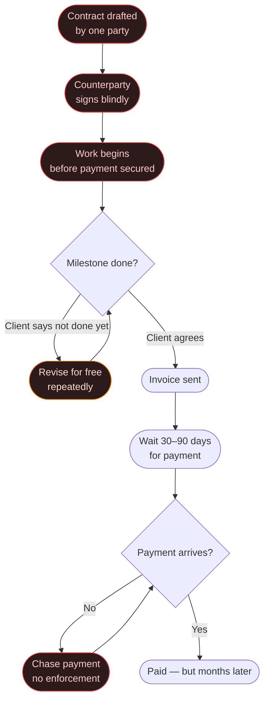
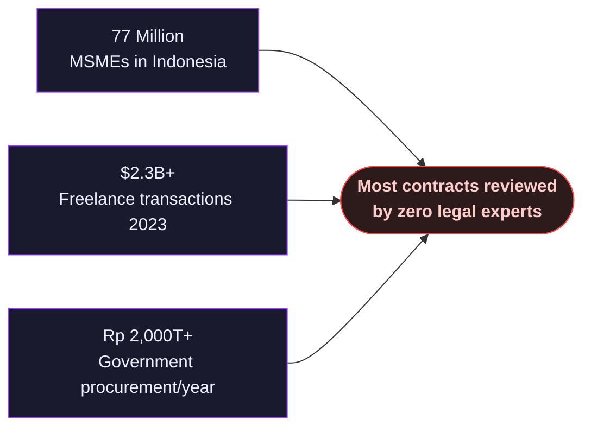

# The Problem

## Contracts Are Broken for Freelancers and Vendors in Indonesia

The Indonesian freelance and procurement market is growing fast — but the contract process hasn't changed in decades. It's still built on blind trust, legal jargon, and handshake payments. That's a recipe for getting burned.

---

## The Broken Status Quo

---

## Pain Point 1: Contracts Are Written Against You

Most contracts are drafted by one party — usually the client or their legal team. By the time the other party reads it, the clauses are already stacked in one direction.

**What gets buried in the fine print:**
- Unlimited revision clauses with no extra pay
- IP rights transferred immediately upon first payment, before full delivery
- Penalties for the contractor but none for the client
- Vague deliverable definitions that can never legally be "completed"
- Payment terms that give clients 60–90 days to pay while work must start immediately

> Most freelancers sign these contracts because they don't know they're unfair — or they know but have no leverage.

---

## Pain Point 2: You Can't Tell If the Price Is Fair

Contract prices in Indonesia are highly opaque. There's no public price registry, and market rates vary wildly by region and vendor type.

**The result:**
- Clients overpay — padded budgets, inflated vendor quotes
- Contractors underprice — desperate to win the bid, then can't profit
- Neither party has a reliable benchmark

A 50-page procurement contract for IT services might include line items for servers, software licenses, and consulting fees — with no way to verify if any of those numbers are close to market rate.

---

## Pain Point 3: Payment Disputes Have No Resolution

When a deliverable is submitted, disputes begin:

> *"This isn't what we agreed to."*
> *"You said it was done — but you haven't paid for 3 months."*

Without a trustless enforcement mechanism, disputes resolve one of three ways:
1. The contractor gives in and revises for free — **loses money**
2. The client withholds payment indefinitely — **contractor loses more money**
3. Both parties go to court — **expensive, slow, outcome uncertain**

There's no system in the middle that both sides can trust.

---

## Pain Point 4: Compliance Is Invisible

Indonesian contracts — especially government procurement and IT services — must comply with a complex web of regulations:

- **UU No. 2/2017** — Jasa Konstruksi
- **Perpres No. 16/2018** — Pengadaan Barang/Jasa Pemerintah
- **UU Ketenagakerjaan No. 13/2003** — Employment contracts
- **KUH Perdata** — General civil obligations

Most people drafting or signing these contracts have no idea whether they're compliant. Non-compliant contracts can be voided entirely — or expose parties to legal liability after signing.

---

## The Scale of the Problem

**The bottom line:** Millions of contracts are signed every year by people who don't know what they're agreeing to, with no mechanism to enforce payment if things go wrong.

---

[How ContractGuard solves this →](solution.md)
