# The Solution

## ContractGuard AI — Audit First. Deploy On-Chain. Get Paid.

ContractGuard handles the full contract lifecycle in three phases. You don't need a lawyer. You don't need to trust the other party. You just need ContractGuard.

---

## The Full Flow

```mermaid
flowchart TD
    A([Upload Contract\nPDF or paste text]) --> B

    subgraph AUDIT ["Phase 1 — AI Audit"]
        B([QVAC AI analyzes\nin under 30 seconds]) --> C1([Fairness Score\n1–10])
        B --> C2([Risky Clauses\nflagged & explained])
        B --> C3([Market Prices\nvs. real Indonesian data])
        B --> C4([Regulation Check\nUU · PP · Perpres])
    end

    C1 & C2 & C3 & C4 --> D{Both parties\nagree?}
    D -->|Needs revision| A
    D -->|Contract OK| E

    subgraph DEPLOY ["Phase 2 — Deploy Escrow"]
        E([Deploy to Solana]) --> F1([USDC locked\nin smart contract])
        E --> F2([Audit hash\nrecorded on-chain])
    end

    F1 & F2 --> G

    subgraph MILESTONE ["Phase 3 — Milestone Loop"]
        G([Contractor works\non milestone]) --> H([Submit evidence\nfiles · links · desc])
        H --> I([QVAC AI verifies\ncompliance score 0–100])
        I --> J{Verdict}
        J -->|NEEDS REVISION| G
        J -->|APPROVED| K([Client approves\none transaction])
        K --> L([Funds released\ninstantly])
        L --> M{More\nmilestones?}
        M -->|Yes| G
        M -->|No| N([Contract complete])
    end

    style AUDIT fill:#1a1a2e,stroke:#9945FF
    style DEPLOY fill:#0d1f1a,stroke:#14F195
    style MILESTONE fill:#0d1a2d,stroke:#38BDF8
```

---

## Phase 1: Audit Before You Sign

Upload your contract (PDF or paste text). In under 30 seconds, ContractGuard's QVAC AI gives you a complete analysis.

**What the AI checks:**

### Fairness Score (1–10)
A single number that tells you how balanced the contract is — before you sign a word.

| Score | Meaning | Action |
|-------|---------|--------|
| 8–10 | Fair for both parties | Safe to proceed |
| 5–7 | Concerns present | Review flagged clauses |
| 1–4 | Significant imbalance | Request revisions |

### Risky Clauses
Every clause that could hurt you is flagged with exact text, the reason it's risky (in plain language), and a specific revision suggestion grounded in Indonesian law.

### Market Price Comparison
Every line item is compared against real Indonesian market data pulled from Blibli, Google Shopping, and other sources via the FastAPI backend.

> *"Server hosting: Rp 15,000,000/month — market rate is Rp 4,000,000–7,000,000. Significantly overpriced."*

### Regulation Compliance
The AI checks your contract type against Indonesian laws and flags any non-compliance — specific article, specific issue.

---

## Phase 2: Deploy On-Chain

Once the contract is agreed and audited, deploy it to Solana in one click.

**What happens on-chain:**
1. Client's USDC transfers into a **smart contract escrow** — locked, inaccessible to either party
2. The audit hash is recorded on-chain — cryptographic proof the contract was reviewed
3. Both wallets are registered — no central authority, no escrow service fees

> **Nobody can touch the money until milestones are verified. Not the client. Not the contractor. Not ContractGuard.**

---

## Phase 3: Verify Milestones & Release Funds

When the contractor finishes a milestone, they upload evidence files and a description directly in the dashboard.

**The QVAC AI reviews evidence automatically:**
- Reads evidence files from local storage at `D:\frontier\evidence\{pdaAddress}\{checkpointIndex}\`
- Cross-references with the original contract PDF stored at `D:\frontier\evidence\{pdaAddress}\contract\`
- Returns a compliance score (0–100) and specific findings
- Verdict: `APPROVED`, `NEEDS REVISION`, or `MAJOR ISSUE`

**When the client approves:**
- One click → one Solana transaction
- Funds release instantly to the contractor's wallet
- No waiting period, no bank transfer delays, no dispute middleman

---

## Supported Contract Types

ContractGuard's AI switches expert personas per contract type — applying the right regulations and industry context automatically.

| Contract Type | Indonesian | AI Expert Persona |
|--------------|-----------|-------------------|
| IT Services | Jasa IT | Software procurement specialist |
| Consulting | Jasa Konsultasi | Management consultant |
| Construction | Konstruksi | Construction contract auditor |
| Goods Procurement | Pengadaan Barang | Procurement & supply chain expert |
| Legal Services | Jasa Hukum | Legal services specialist |
| Education/Training | Jasa Pendidikan | Training program consultant |
| Employment | Ketenagakerjaan | HR & labor law specialist |
| Other Services | Jasa Lainnya | General contract expert |

---

[Why ContractGuard over alternatives →](why-us.md)
